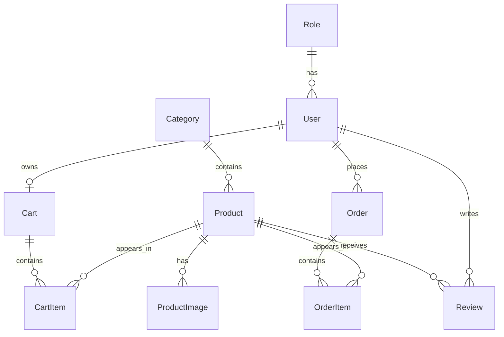

# Database Design

## ERD

## Main Tables

| Table | Purpose |
| --- | --- |
| `Role` | RBAC role catalog: customer, manager, admin |
| `User` | Account, profile, credentials, role |
| `Category` | Product grouping and storefront filters |
| `Product` | Sellable SKU, price, inventory, search fields |
| `ProductImage` | Product gallery |
| `Cart` | One active cart per user |
| `CartItem` | Product quantity inside cart |
| `Order` | Checkout snapshot, shipping, payment, status |
| `OrderItem` | Purchased product snapshot |
| `Review` | Product rating and feedback |

The full Prisma schema is in `apps/api/prisma/schema.prisma`.
