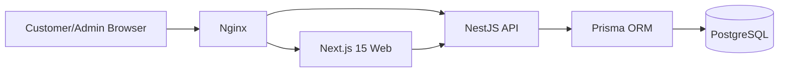
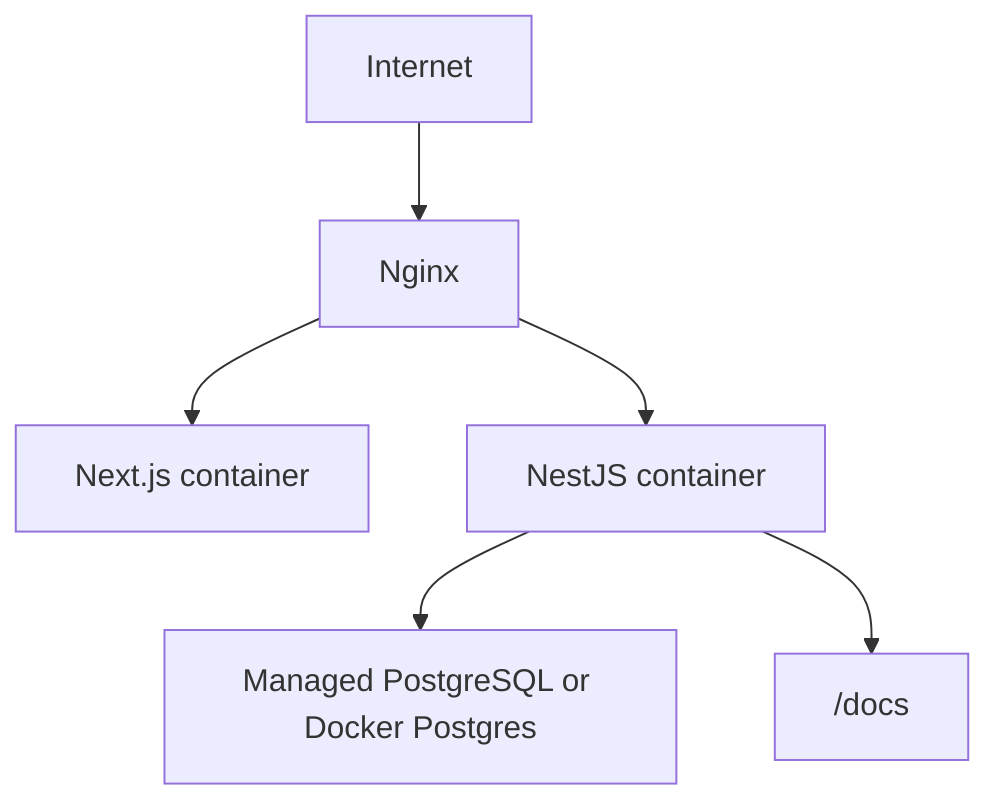

# System Architecture

## Overview

Economic Website is a modular e-commerce MVP with a Next.js storefront, NestJS REST API, PostgreSQL database, Prisma ORM, Docker Compose runtime, and Nginx reverse proxy.

## Frontend Structure

- `src/app`: App Router pages for landing, products, cart, checkout, auth, profile, orders, admin
- `src/components/ui`: shadcn/ui-inspired reusable primitives
- `src/components/layout`: header and React Query provider
- `src/components/product`: commerce-specific product components
- `src/store`: Zustand cart state
- `src/lib`: product fixtures, formatters, utilities

## Backend Structure

- `common/prisma`: Prisma client lifecycle
- `common/guards`: JWT and RBAC guards
- `modules/auth`: register, login, logout, forgot password
- `modules/products`: public catalog and admin product mutation
- `modules/categories`: category management
- `modules/cart`: authenticated cart operations
- `modules/orders`: checkout and order history
- `modules/admin`: dashboard, user and order overview

## RBAC Design

Roles:

- `CUSTOMER`: browse, profile, cart, checkout, own orders
- `MANAGER`: customer permissions plus product/category/order management
- `ADMIN`: full dashboard, user management, all admin APIs

Protected admin routes use `JwtAuthGuard` plus `RolesGuard`.

## Authentication Flow

1. User registers or logs in.
2. API validates credentials and signs a JWT with `sub`, `email`, and `role`.
3. Frontend stores token in an auth store or httpOnly cookie in the next hardening step.
4. Client sends `Authorization: Bearer <token>`.
5. API resolves the current user and applies RBAC checks.

## Deployment Architecture

Recommended production additions:

- Managed PostgreSQL with automated backups
- Redis for sessions, queues, and rate limiting
- Object storage for product images
- CI/CD with lint, build, migration checks, and Playwright smoke tests
- Observability with structured logs and metrics
